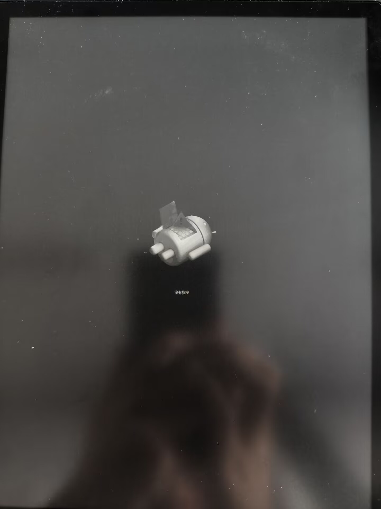
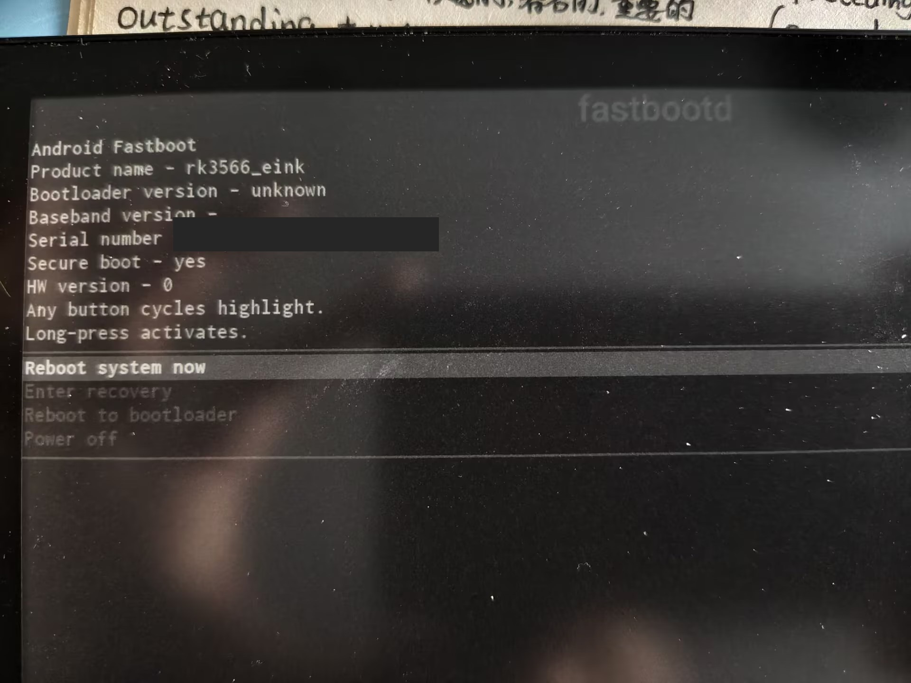
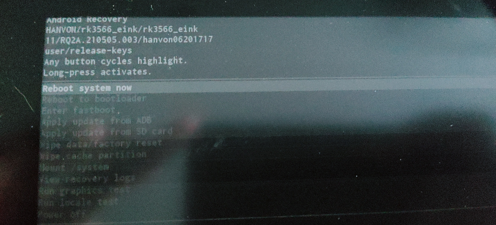

# 启动模式实机记录

以下照片已按正确方向保存。包含序列号的照片已在公开版本中遮挡唯一设备标识。

## 返回键 + 电源键：No command

设备关机后使用返回键与电源键组合，可到达原厂 Recovery 的“没有指令（No command）”画面。



## `adb reboot fastboot`：Android Fastboot / fastbootd

在已授权 ADB 的 Android 系统中执行：

```sh
adb reboot fastboot
```

设备进入 Android Fastboot 菜单。画面显示 `fastbootd`，并提供 `Enter recovery`、`Reboot to bootloader` 等菜单项。



## fastbootd 的 `Reboot to bootloader`

在上述 fastbootd 菜单中选择 `Reboot to bootloader` 后，实机显示 Android Recovery 菜单。这个结果说明该菜单项没有提供一个已验证可用的传统 fastboot 刷写界面。



> [!NOTE]
> 本设备显示的 “Any button cycles highlight / Long-press activates” 表示任意可识别按键短按移动、长按确认。翻页键不能未经验证就等同于标准 Android 设备的 Volume Up/Down。
